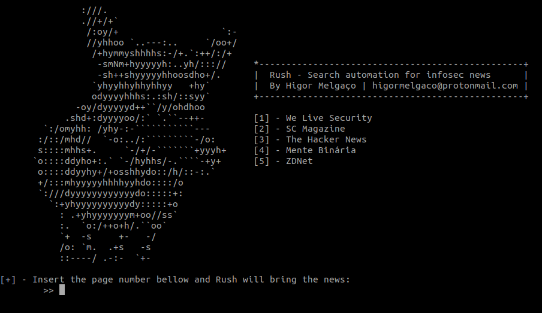

# Rush
This project consists of automating the search of news from known sources.

Sources lists:

- [We Live Security](https://www.welivesecurity.com/br/);
- [SC Magazine](https://www.scmagazine.com/);
- [The Hacker News](https://thehackernews.com/);
- [Mente Binaria](https://www.mentebinaria.com.br/noticias/);
- [ZD Net](https://www.zdnet.com/topic/security/);

## Prerequisites

- [Python 3.x](https://www.python.org/downloads/release/python-376/)

### Installing
```
pip install -r requirements.txt
```

## Running
```
python run.py
``` 

